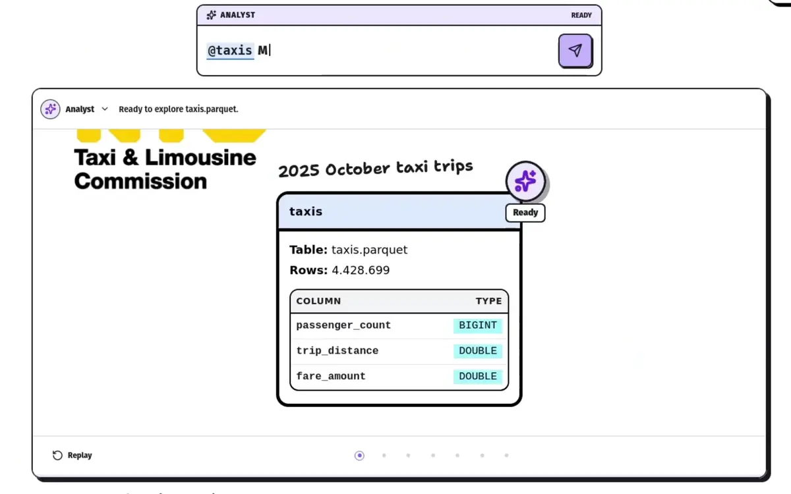

# Kavla



Kavla is an infinite canvas for exploratory analysis. It's all about embracing the analytical mess. Paste a picture, draw some shapes, write some SQL, make a chart. Compared to a notebook, in Kavla you can easily branch your analysis. Just move the dead ends to another side of the canvas.

Try it in your browser at [kavla.dev](https://kavla.dev), or [download directly](https://kavla.dev/download).

## Desktop App (Linux only)

Make it executable and then launch it!

## CLI

Download the CLI from the release page, then run:

```sh
kavla run
```

This will start a web server that serves the application on http://localhost:40743/

Use the flag `--host 0.0.0.0` to allow others to connect

## Docker

```sh
 docker run --rm -p 40743:40743 -v kavla-data:/data aleda145/kavla:latest
```

Or see [compose.yaml](./compose.yaml)

There is no access control for the web server. Don't put it online without adequate security!

## Agents

Codex CLI and OpenAI compatible endpoints are supported.

I recommend using an endpoint. The codex CLI will work but it pollutes the context quite a bit.

I've had good success with Kimi 2.7. If you try something else and you're happy with it please me know in the [discord](https://discord.gg/aeBGuDdhtP)

## Supported Sources

| Source    | Type        | Connection                                           |
| --------- | ----------- | ---------------------------------------------------- |
| DuckDB    | `duckdb`    | Path to an existing DuckDB file                      |
| Directory | `directory` | Path to a directory with CSV, Parquet, or JSON files |
| BigQuery  | `bigquery`  | Google Cloud project ID (experimental)               |
| Postgres  | `postgres`  | Postgres URI                                         |

If there's a source you want, please raise an issue!

## Real Time Collaboration

The CLI can also connect to canvases on [Kavla Cloud](https://kavla.dev/cloud) so you can share your analysis, both privately and publically.

### Login

```sh
kavla login
```

### Connect to a canvas

```sh
kavla connect
```

Or connect directly:

```sh
kavla connect <room_id>
```

## Building

Install go, yarn and node. Then run `make build`

## Contributions & Community

Contributions welcome! Reach out on the discord if there's something specific you've been thinking of!

[discord](https://discord.gg/aeBGuDdhtP)

## Talk to me

I'm Alex:

- Email me [alex@kavla.dev](mailto:alex@kavla.dev)
- visit my website at [dahl.dev](https://dahl.dev)
- Connect with me on [Linkedin](https://www.linkedin.com/in/dahlalexander)
- [twitter](https://x.com/alexdahl145)

## Licensing

Kavla's original source code is licensed under the [Apache License 2.0](./LICENSE).

Third-party components remain under their own terms. See [Third-party software and licenses](./THIRD_PARTY_LICENSES.md), including the separately licensed tldraw SDK and the bundled [tldraw 3.15.4 license](./TLDRAW_LICENSE.md).

(tldraw changed their license for version >4 and it disallows hosting outside a dev environment without a license (I'm poor))
